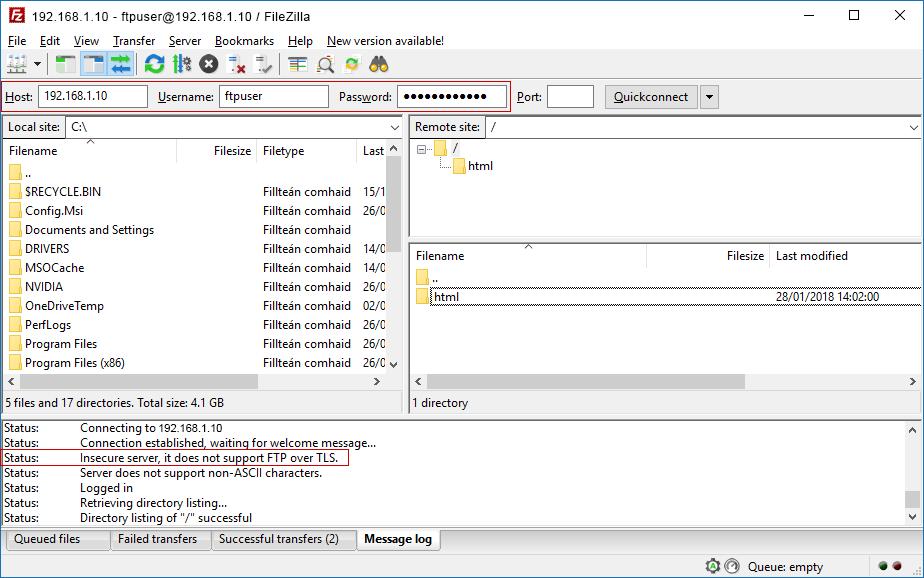

<!--more-->

# Use the free Victoria program to test and fix your hard drive

Victoria — free hard drive test and repair program is a useful and versatile tool for testing and fixing all kinds of hard drive errors. We will analyze its functions, features and basic capabilities 

## Content:

1. [Victoria capabilities](https://recoverhdd.com/blog/using-victoria-for-testing-repair-hard-drive.html#ch1)
2. [Getting started with Victoria](https://recoverhdd.com/blog/using-victoria-for-testing-repair-hard-drive.html#ch2)
3. [Description of tabs](https://recoverhdd.com/blog/using-victoria-for-testing-repair-hard-drive.html#ch3)
4. [How can I quickly diagnose a drive?](https://recoverhdd.com/blog/using-victoria-for-testing-repair-hard-drive.html#ch4)
5. [Other important S.M.A.R.T. points you should know about](https://recoverhdd.com/blog/using-victoria-for-testing-repair-hard-drive.html#ch5)
6. [Testing the drive and fixing errors](https://recoverhdd.com/blog/using-victoria-for-testing-repair-hard-drive.html#ch6)
7. [“Erase” and “Write” functions](https://recoverhdd.com/blog/using-victoria-for-testing-repair-hard-drive.html#ch7)

Not only ease of use and speed, but also the security of stored information depends on the correct operation of each component of the computer. That is why you should always pay due attention to hard drives and other drives where various valuable files are located.

At the moment there are many solutions for checking and fixing errors on your hard drive. Today we will consider checking your hard drive with the popular **free program Victoria**, which can quickly solve many problems with **HDD** and **SSD**.

## Victoria capabilities

Программа The Victoria program is distributed free of charge so that it can be downloaded from the manufacturer’s [official website](http://hdd.by/victoria/). Among the key features of Victoria is its multifunctionality, as well as unique work algorithms that allow you to perform various manipulations with any type of hard drive. With the help of this software, you can achieve accelerated and stable operation of hard drives, which, as a result, will give an excellent addition to the performance of the whole PC.

Besides, the program allows:

- Replace **problem sectors** of the drive
- Carry out cleaning of **broken areas**
- Fix **non-functioning** areas on hard drives
- Fix various **errors**

The above features can be of great benefit to professionals and ordinary users alike who have decided to troubleshoot various HDD issues.

## Getting started with Victoria

To start working with the Victoria program, you need to download it. The easiest way to do this is on the official website of the developers, where the latest versions of the program are always available.

After that, you need to extract the downloaded file using any archiver. After extraction, installation is not required. All you need to do is run the program as an administrator in the unzipped folder.

## Description of tabs

In the opened program you can see the tabs **Standart**, **SMART**, **Test**, **Advanced** and **Setup**, which are responsible for various modes of work.

We will look at each of them below.

## Standard Tab

This tab contains **necessary information** about all drives and flash drives installed in the PC. If a user has more than one drive installed, information about them can be found by selecting the appropriate drive in the window on the right. Detailed information (model, manufacturer, function support, etc.) is displayed in the left window. Also, you can perform a simple check on the Standard tab and some other functions.

## Tab SMART

This tab provides **advanced hard disk analysis** and complete **information from HDD sensors.** Here you can find the general status of the drive as well as other parameters. To start scanning, you should press the **Get SMART button.**. To the right of it, there is a **general device status indicator.** Besides, this tab contains a wide range of functions for working with the drive.

## Tests tab

The Tests tab provides basic functionality to check your hard drive for errors. When you click **Scan** you can see a graphical display of the presence of disk area defects. Under the **Scan button,** there is a colored column displaying the number of incorrectly working sectors. It should be noted that in the Test tab, there is also available hard disk error correction functionality. It is located on the right side of the program window.

The functions are placed even lower:

- Ignore – the program will not use any actions to correct errors.
- Erase – complete removing of damaged sectors. (Applies only in extreme cases).
- Remap – the damaged sectors will be replaced with backup ones.
- Restore – the program will restore the performed sectors.

## Advanced and Setup tabs

The Advanced tab is designed to provide detailed information on specific sectors. The Setup tab is responsible for various fine settings for checking and displaying the program menu.

## How can I quickly diagnose a drive?

To quickly assess the status of your drive in Victoria, go to the **SMART** tab and click on the **Get Smart** button.

Now you should pay attention to the **important points** and the **Raw** parameter:

- 1 – **frequency of errors** during analysis.
- 5 – **sectors assigned** to the reserve area.
- 9 – **number of hours** that HDD has been working.
- 187 – **number of damaged sectors** that will need to be reassigned soon.
- 195 – **number of errors** in sectors, **fixed by program.**
- 196 – **number of performed operations** on sector reassigned.

As you can see from the screenshot below, this disc is in excellent condition, which is indicated by the green button **«Good»**. It is due to its short lifetime (only 15 hours in point 9 Power on Time).

## Other important S.M.A.R.T. points you should know about

To understand the diagnostic results of the drive, you need to know what other S.M.A.R.T. points mean, to make conclusions about the condition of the drive.

- **Val** – is the current value of the attribute. The evaluation of the parameter is based on the difference between **Val** and **Trash** values. For example, in this situation for parameter 5 (Reallocated Sector Count), Val is 100, and Trash – 50. The difference is 50 units, which indicates that the drive is in a healthy state. If Val is close to Trash, it suggests that there will be no sectors left on the drive for re-assigning, and the drive will become unusable.
- **Wrst** – indicates the lowest Val value that the drive has ever had.
- **Tresh** – is very important value indicating the threshold of the Val parameter. When this threshold is reached by the Val parameter, the drive can be considered to have exhausted its resource.
- **Raw** – is one of the most important points by which you can evaluate the state of your drive. This value is used to calculate the Val parameter and also displays such important data as operating hours (for point 9 Power-on time) or the number of operations to reassign faulty blocks (point 196 Reallocation Event Count).

By knowing the values of each parameter, it is easy to assess the state of the drive independently.

## Testing the drive and fixing errors

After a quick analysis, you should go to the **Tests** tab where you can perform an in-depth check and correction of possible errors. To do this, click the **Scan** button and check the entire drive for errors and broken sectors.

The principle of this test is the following: the program sends signals to the sectors of the disk and, based on the response waiting time, makes conclusions about the state of each sector. If the test identifies problem areas, you need to apply the **Remap** and **Refresh** functions one by one. Thus, after the analysis is complete, select Remap and start the test. After that, we repeat the action with the Refresh function.

For the first time, all problem zones will be replaced by backup zones, and those that are left will be restored using the program.

It should be understood that the Victoria program cannot repair the physical defects of the hard drive or repair sectors with complicated damages. However, using Victoria, you can recover a large number of areas and significantly increase the performance of the entire PC.

## “Erase” and “Write” functions

The **Erase** function allows you to overwrite the entire block of sectors (256 pcs.) with zeros when an unreadable sector is detected. This function is highly recommended not to be used with a drive where vital data is stored as it can cause the data to be deleted.

It should be noted that the **Erase** function is extremely useful when **removing logical damaged blocks**. At the same time, it is impossible to restore physical blocks. In this situation, only **reassignment** will help. “Erase” should be used in cases when simple reassignment or recovery did not bring proper results. After using the “Erase” block can become healthy and return to work, at the same time, all data on it will be deleted without a trace.

The **Write** function, unlike Erase, does not search for unreadable sectors, but overwrites the whole block with zeros immediately. This function allows , but all information on disk will be irrevocably lost.